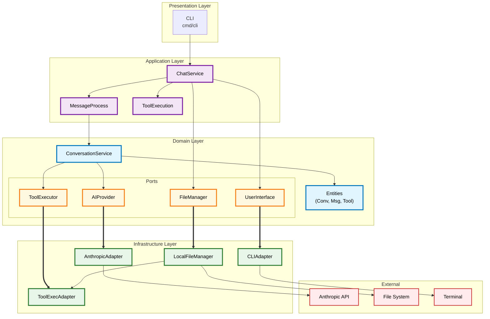

# Code Editing Agent

[](https://go.dev/)
[](LICENSE)
[](https://github.com/yourusername/code-editing-agent/actions)

A sophisticated AI-powered command-line coding assistant built with Go using hexagonal (clean) architecture principles. The agent provides an interactive chat interface for code exploration, editing, and analysis with integrated tool capabilities and advanced AI features.

## 🌟 Key Features

- **🤖 Interactive CLI Chat** - Terminal-based conversation with AI assistant
- **🧠 Extended Thinking** - Claude's internal reasoning process with configurable token budgets
- **📁 File System Tools** - Read, list, and edit files directly from chat
- **🔄 Subagent System** - Spawn specialized AI assistants for delegated tasks
- **📋 Plan Mode** - Propose changes for review before applying them
- **🏗️ Hexagonal Architecture** - Clean separation of concerns with ports and adapters
- **🔧 Modular Tool System** - Extensible architecture for adding custom tools with JSON schema validation
- **🎯 Skill System** - Project-specific and global AI capabilities following agentskills.io
- **🔍 Investigation System** - Structured problem analysis with confidence tracking and escalation

## 📋 Table of Contents

- [Quick Start](#quick-start)
- [Installation](#installation)
- [Usage](#usage)
- [Architecture](#architecture)
- [Configuration](#configuration)
- [Development](#development)
- [Contributing](#contributing)
- [License](#license)

## 🚀 Quick Start

```bash
# Set your Anthropic API key
export ANTHROPIC_API_KEY=your-api-key-here

# Build and run the agent
go build -o agent ./cmd/cli
./agent chat

# Or run directly with Go
go run ./cmd/cli main.go chat
```

## Architecture

This project follows hexagonal architecture (also known as ports and adapters), ensuring the domain logic remains independent of external concerns.

### Architecture Diagram



### Layer Responsibilities

| Layer | Responsibility | Located In |
|-------|---------------|------------|
| **Presentation** | CLI commands, user input/output handling | `cmd/cli/` |
| **Application** | Use cases, orchestration, DTOs | `internal/application/` |
| **Domain** | Business entities, services, port interfaces | `internal/domain/` |
| **Infrastructure** | Port implementations, external integrations | `internal/infrastructure/` |

## Project Structure

```
code-editing-agent/
├── cmd/
│   └── cli/
│       ├── main.go              # CLI entry point
│       └── cmd/
│           ├── root.go          # Root command setup
│           └── chat.go          # Chat command implementation
├── internal/
│   ├── application/
│   │   ├── dto/                 # Data transfer objects
│   │   ├── service/             # Application services
│   │   └── usecase/             # Use case implementations
│   ├── domain/
│   │   ├── entity/              # Domain entities (Conversation, Message, Tool)
│   │   ├── port/                # Port interfaces (AI, File, Tool, UI, Skill)
│   │   └── service/             # Domain services
│   └── infrastructure/
│       ├── adapter/             # Port implementations
│       │   ├── ai/              # AI provider adapters
│       │   ├── file/            # File manager adapters
│       │   ├── skill/           # Skill manager adapters
│       │   ├── tool/            # Tool executor adapters
│       │   └── ui/              # User interface adapters
│       └── config/              # Configuration & DI container
├── skills/                      # Project-specific skills (agentskills.io spec)
├── CLAUDE.md                    # Project development guide
├── go.mod                       # Go module definition
└── go.sum                       # Dependency checksums
```

## 📦 Installation

### Prerequisites

- **Go 1.24 or later** - [Install Go](https://go.dev/doc/install)
- **Anthropic API Key** - Get one from [console.anthropic.com](https://console.anthropic.com/)

### Installation Methods

#### Method 1: Build from Source (Recommended)

1. **Clone the repository**
   ```bash
   git clone https://github.com/yourusername/code-editing-agent.git
   cd code-editing-agent
   ```

2. **Install dependencies**
   ```bash
   go mod download
   ```

3. **Build the application**
   ```bash
   go build -o agent ./cmd/cli
   ```

#### Method 2: Global Install via Go

```bash
go install github.com/yourusername/code-editing-agent/cmd/cli@latest
```

### Verify Installation

```bash
# Check the agent is working
./agent --version

# Test with a simple command
./agent chat --help
```

## 🎯 Usage

### Basic Chat

```bash
./agent chat
```

Once started, you can interact naturally:

```
Chat with Claude (use 'ctrl+c' to quit)
New session started: 3a1b2c3d4e5f6789...
> List all Go files in the current directory
[Assistant: Reading files...]
[Tool: list_files executed]
[Assistant: Found 5 Go files...]
```

### Extended Thinking Mode 🧠

Extended thinking allows Claude to show its internal reasoning process before generating responses. This feature helps you understand how the AI approaches problems and can improve response quality for complex tasks.

#### Enabling Extended Thinking

**Via CLI flags:**
```bash
# Enable with defaults (10,000 token budget, thinking hidden)
./agent chat --thinking

# Enable with custom budget and show thinking
./agent chat --thinking --thinking-budget 15000 --show-thinking
```

**Via environment variables:**
```bash
export AGENT_THINKING_ENABLED=true
export AGENT_THINKING_BUDGET=10000
export AGENT_SHOW_THINKING=true
./agent chat
```

**Via runtime commands:**
```
> :thinking on         # Enable thinking mode
Extended thinking enabled (budget: 10000 tokens)

> :thinking off        # Disable thinking mode
Extended thinking disabled

> :thinking budget 15000  # Set custom budget
Thinking budget set to 15000 tokens

> :thinking toggle    # Toggle current state
```

#### Extended Thinking Configuration

| Option | Default | Description |
|--------|---------|-------------|
| `--thinking` | `false` | Enable extended thinking mode |
| `--thinking-budget` | `10000` | Token budget for thinking (min 1024) |
| `--show-thinking` | `false` | Display AI's reasoning process |
| `--max-tokens` | `20000` | Maximum tokens for responses |

**Notes:**
- Extended thinking requires Claude 3.5 Sonnet or newer models
- The thinking budget is separate from but counted within `max-tokens`
- By default, thinking is processed but not displayed (hidden from output)
- Use `--show-thinking` to see the AI's reasoning in the terminal

### Available Tools

| Tool | Description | Usage |
|------|-------------|-------|
| `read_file` | Read file contents | Ask the AI to "Read file: main.go" |
| `list_files` | List files in directory | Ask to "List all files in ./internal" |
| `edit_file` | Edit files via string replacement | Ask to "Replace this text in file.go" |
| `bash` | Execute shell commands | Ask to "Run command: go test ./..." |
| `fetch` | Fetch web resources via HTTP/HTTPS | Ask to "Fetch the contents of https://example.com" |
| `task` | Spawn a pre-defined subagent | Ask to "Delegate security review to code-reviewer" |
| `delegate` | Spawn a dynamic subagent | Ask to "Create an agent to analyze this log file" |
| `batch_tool` | Execute multiple tools in parallel/sequence | Ask to "Read all these 3 files at once" |
| `activate_skill` | Load skill instructions | Ask to "Activate the code-review skill" |
| `enter_plan_mode`| Propose changes before execution | Ask to "Enter plan mode to redesign this" |
| `complete_investigation` | Complete an investigation with findings | Used to finalize investigation with confidence and findings |
| `escalate_investigation` | Escalate investigation to higher priority | Used to escalate issues requiring human review |
| `report_investigation` | Report progress during investigation | Used to provide status updates during investigation |

**Built-in Safety Features:**
- **Path Traversal Protection**: All file operations are sandboxed within the working directory
- **Command Validation Modes**: Blacklist (default) or whitelist approach for bash commands
- **Dangerous Command Detection**: Commands like `rm -rf`, `dd`, format operations require confirmation
- **Graceful Shutdown**: Double Ctrl+C to exit, single press shows help message

#### Command Validation Modes

The agent supports two modes for validating bash commands:

**Blacklist Mode (Default):** Blocks known dangerous commands while allowing everything else. Dangerous patterns include destructive operations (`rm -rf /`), privilege escalation (`sudo`), and network piping (`curl | bash`).

**Whitelist Mode:** Only allows explicitly whitelisted read-only commands. Enable with:
```bash
export AGENT_COMMAND_VALIDATION_MODE=whitelist
```

Default whitelisted commands include:
- File reading: `ls`, `cat`, `head`, `tail`, `less`, `wc`
- Search: `grep`, `rg`, `find`, `fd`, `which`
- Git (read-only): `git status`, `git log`, `git diff`, `git show`
- System info: `pwd`, `whoami`, `ps`, `df`, `du`
- Container (read-only): `docker ps`, `kubectl get`

Write operations (`mkdir`, `rm`, `git push`, `npm install`) are NOT whitelisted by default. Some commands use exclude patterns to block dangerous flags while allowing safe usage.

**Adding Custom Whitelist Patterns:**

Use the `AGENT_COMMAND_WHITELIST_JSON` environment variable with a JSON array of pattern objects:

```bash
# Allow a single custom command
export AGENT_COMMAND_WHITELIST_JSON='[
  {"pattern": "^my-safe-tool(\\s|$)", "description": "my safe tool"}
]'

# Allow multiple custom commands
export AGENT_COMMAND_WHITELIST_JSON='[
  {"pattern": "^my-tool(\\s|$)", "description": "my tool"},
  {"pattern": "^another-tool\\s", "description": "another tool"},
  {"pattern": "^make\\s+test", "description": "make test target"}
]'

# Allow go build and go run (not in default whitelist)
export AGENT_COMMAND_WHITELIST_JSON='[
  {"pattern": "^go\\s+build(\\s|$)", "description": "go build"},
  {"pattern": "^go\\s+run\\s", "description": "go run"}
]'

# Allow npm install for a specific project
export AGENT_COMMAND_WHITELIST_JSON='[
  {"pattern": "^npm\\s+install(\\s|$)", "description": "npm install"}
]'
```

Each entry in the JSON array supports:
- `pattern` (required): Regex pattern to match commands
- `exclude_pattern` (optional): Regex pattern to block even if the main pattern matches
- `description` (optional): Human-readable description of the pattern

**Exclude Patterns:**

Use `exclude_pattern` to allow a command while blocking dangerous flags:

```bash
# Allow find but block -exec, -delete, and similar dangerous flags
export AGENT_COMMAND_WHITELIST_JSON='[
  {
    "pattern": "^find(\\s|$)",
    "exclude_pattern": "(?i)(-exec\\s|-execdir\\s|-delete(\\s|$)|-ok\\s|-okdir\\s)",
    "description": "find files (read-only)"
  }
]'
```

This allows `find . -name "*.go"` but blocks `find . -exec rm {} \;`. The `(?i)` prefix makes the exclusion case-insensitive.

**Pattern syntax tips:**
- `^command` - Match at start of line
- `(\s|$)` - Match whitespace or end of string (for commands with or without args)
- `\s+` - Match one or more whitespace characters
- Patterns are Go regular expressions

**Piped Commands:** In whitelist mode, piped commands (e.g., `ls | grep foo`) are validated by checking each segment independently. All segments must be whitelisted for the command to execute.

**LLM Fallback:** When `AGENT_ASK_LLM_ON_UNKNOWN=true` (default), non-whitelisted commands prompt for user confirmation instead of being immediately blocked. Set to `false` for strict whitelist-only mode.

**Investigation Mode:** Command validation applies consistently in both interactive chat and investigation/daemon mode. The same whitelist/blacklist configuration governs both modes, so security policies are enforced regardless of how the agent is running.

**Security Note:** Environment variables (`$VAR`, `${VAR}`) are NOT expanded during validation. The whitelist checks literal command text, but shell expands variables at runtime. Be cautious with commands that may output sensitive environment data. Note that command substitutions (`$()` and backticks) ARE recursively validated.

See CLAUDE.md for the complete list of default whitelisted commands and additional configuration options.

### Skills

Skills extend the agent's capabilities with specialized knowledge, workflows, or tool integrations. They follow the [agentskills.io](https://agentskills.io) specification.

#### Skill Discovery Locations

Skills are discovered from three directories in **priority order**:

| Priority | Directory | Description |
|----------|-----------|-------------|
| 1 (highest) | `./skills` | Project-specific skills in project root |
| 2 | `./.claude/skills` | Project-specific skills in .claude directory |
| 3 (lowest) | `~/.claude/skills` | User's global skills (shared across projects) |

When the same skill name exists in multiple directories, the **highest priority** version is used. This allows you to override global skills with project-specific versions.

#### Skill Structure

Each skill is a directory containing a `SKILL.md` file with YAML frontmatter:

```
skills/
├── code-review/
│   └── SKILL.md
└── my-custom-skill/
    ├── SKILL.md
    ├── scripts/       # Optional executable scripts
    └── references/    # Optional documentation
```

**Example SKILL.md:**
```yaml
---
name: code-review
description: Reviews code for best practices, errors, and improvements
allowed-tools: read_file list_files
---

# Code Review Skill

Instructions for how the AI should perform code reviews...
```

#### Using Skills

Skills are automatically discovered at startup and listed in the AI's context. The AI can activate a skill when its capabilities are needed using the `activate_skill` tool.

### Subagent System

The subagent system allows the main agent to delegate tasks to specialized or dynamic AI assistants. This is useful for complex, multi-step tasks or when isolation is beneficial.

#### Pre-defined Subagents

Subagents are discovered from three directories in **priority order**:
1. `./agents` (project root, highest priority)
2. `./.claude/agents` (project .claude directory)
3. `~/.claude/agents` (user global, lowest priority)

When the same agent name exists in multiple directories, the highest priority version is used. Common agents include `code-reviewer`, `test-writer`, and `documentation-writer`. Each agent has its own `AGENT.md` file defining its system prompt, allowed tools, model selection, and thinking configuration.

**Agent Configuration Options:**
- **allowed_tools**: Restrict which tools the agent can use for safety
- **model**: Choose between `haiku` (fast), `sonnet` (balanced), `opus` (complex), or `inherit` (default)
- **max_actions**: Limit tool calls to prevent runaway execution (default: 20)
- **thinking_enabled**: Enable/disable extended thinking for this agent (default: inherit)
- **thinking_budget**: Token budget for thinking process (default: inherit)

See CLAUDE.md for detailed AGENT.md format and frontmatter options.

**Usage:**
```
> Delegate a security review of internal/infrastructure to the code-reviewer agent
```

#### Dynamic Subagents (Delegation)

You can also create dynamic agents on-the-fly with custom system prompts using the `delegate` tool.

**Usage:**
```
> Use the delegate tool to create a 'regex-specialist' to help fix these patterns
```

### Plan Mode

Plan mode allows you to review and approve proposed changes before they are applied. When in plan mode, tools like `edit_file` or `bash` (if mutating) will write their intended actions to a plan file instead of executing them.

#### Activating Plan Mode

**Via runtime command:**
```
> :mode plan      # Enable plan mode
> :mode normal    # Return to normal mode
> :mode toggle    # Toggle between modes
```

**Via tool:**
The AI can proactively enter plan mode using the `enter_plan_mode` tool when it detects a complex task.

### Configuration

The application supports configuration via:

**Command-line flags:**
```bash
./agent chat --model "hf:zai-org/GLM-4.6" --max-tokens 20000 --thinking
```

**Environment variables (AGENT_* prefix):**
```bash
export AGENT_MODEL=hf:zai-org/GLM-4.6
export AGENT_MAX_TOKENS=20000
export AGENT_WORKING_DIR=/path/to/project
export AGENT_WELCOME_MESSAGE="Hello! How can I help?"
export AGENT_GOODBYE_MESSAGE="Goodbye!"
export AGENT_HISTORY_FILE=""  # Disable history
export AGENT_HISTORY_MAX_ENTRIES=500
export AGENT_THINKING_ENABLED=true
export AGENT_THINKING_BUDGET=10000
export AGENT_SHOW_THINKING=false

# Command validation (security)
export AGENT_COMMAND_VALIDATION_MODE=whitelist  # or "blacklist" (default)
export AGENT_COMMAND_WHITELIST_JSON='[{"pattern": "^custom-cmd\\s", "description": "custom command"}]'
export AGENT_ASK_LLM_ON_UNKNOWN=true            # Ask before blocking non-whitelisted
```

**Configuration options:**
| Option | Default | Description |
|--------|---------|-------------|
| `--model` | `hf:zai-org/GLM-4.6` | AI model to use |
| `--max-tokens` | `20000` | Maximum tokens in responses |
| `--thinking` | `false` | Enable extended thinking mode |
| `--thinking-budget` | `10000` | Token budget for thinking (min 1024) |
| `--show-thinking` | `false` | Display AI's reasoning process |
| `--workingDir` | `.` | Base directory for file operations |
| `--welcomeMessage` | `Chat with Claude...` | Displayed on session start |
| `--goodbyeMessage` | `Bye!` | Displayed on session end |
| `--historyFile` | `~/.agent-history` | Command history file location |
| `--historyMaxEntries` | `1000` | Maximum history entries to keep |

**Security configuration (environment variables only):**
| Variable | Default | Description |
|----------|---------|-------------|
| `AGENT_COMMAND_VALIDATION_MODE` | `blacklist` | `blacklist` or `whitelist` |
| `AGENT_COMMAND_WHITELIST_JSON` | (none) | JSON array of additional regex patterns |
| `AGENT_ASK_LLM_ON_UNKNOWN` | `true` | Ask LLM before blocking non-whitelisted commands |

## Development

### Running Tests

```bash
# Run all tests
go test ./...

# Run with coverage
go test -cover ./...

# Run specific package tests
go test ./internal/domain/entity -v
go test ./internal/infrastructure/adapter/file -v
```

### Building

```bash
# Standard build
go build -o code-editing-agent ./cmd/cli

# Optimized build (smaller binary)
go build -ldflags="-s -w" -o code-editing-agent ./cmd/cli
```

### Code Quality

```bash
# Format code
go fmt ./...

# Run static analysis
go vet ./...
```

## Onboarding Guide for Contributors

### Understanding the Codebase

#### 1. Start with the Domain Layer
The domain layer is the heart of the application and contains no external dependencies:

- **Entities** (`internal/domain/entity/`)
  - `Conversation` - Manages chat state and message collection
  - `Message` - Represents individual messages with role, content, and validation
  - `Tool` - Represents executable tools with schema validation

- **Domain Services** (`internal/domain/service/`)
  - `ConversationService` - Core business logic for managing conversations

- **Ports** (`internal/domain/port/`)
  - `AIProvider` - Interface for AI service integration
  - `FileManager` - Interface for file operations
  - `ToolExecutor` - Interface for tool execution
  - `UserInterface` - Interface for CLI interactions

#### 2. Review the Application Layer
This layer orchestrates use cases using domain services:

- **Use Cases** (`internal/application/usecase/`)
  - `MessageProcessUseCase` - Handles message processing flow
  - `ToolExecutionUseCase` - Handles tool execution

- **Services** (`internal/application/service/`)
  - `ChatService` - High-level orchestration service

- **DTOs** (`internal/application/dto/`)
  - Request/response objects for layer boundaries

#### 3. Examine the Infrastructure Layer
Implementations of the ports defined in the domain:

- **Adapters** (`internal/infrastructure/adapter/`)
  - `ai/anthropic_adapter.go` - Anthropic API implementation
  - `file/local_file_adapter.go` - Local file system operations
  - `tool/tool_executor_adapter.go` - Built-in tools (read, list, edit)
  - `ui/cli_adapter.go` - Terminal interface

- **Config** (`internal/infrastructure/config/`)
  - `container.go` - Dependency injection container
  - `config.go` - Configuration management

#### 4. CLI Entry Point
- `cmd/cli/main.go` - Application entry point
- `cmd/cli/cmd/` - CLI command definitions using cobra

### Adding a New Tool

1. **Define the tool in the adapter** (`internal/infrastructure/adapter/tool/tool_executor_adapter.go`)

```go
// In NewExecutorAdapter(), register your tool:
tool := entity.NewTool("search_content", "Search for content in files")
// Set up input schema, then...
exec.RegisterTool(*tool)

// And implement the logic in the ExecuteTool method:
case "search_content":
    return s.searchInFile(input)
```

2. **Tests are required** - Add corresponding tests in `*_test.go`

### Adding a New AI Provider

1. **Implement the AIProvider port** in `internal/infrastructure/adapter/ai/`
2. **Register in the container** - Update `internal/infrastructure/config/container.go`

### Testing Philosophy

The project uses table-driven tests throughout. Look at existing tests for patterns:

- `internal/domain/entity/*_test.go` - Examples of entity testing
- `internal/domain/service/*_test.go` - Service testing with mocks
- `internal/infrastructure/adapter/*/_test.go` - Adapter testing

## Dependencies

| Package | Version | Purpose |
|---------|---------|---------|
| `github.com/anthropics/anthropic-sdk-go` | v1.19.0 | Anthropic API client |
| `github.com/invopop/jsonschema` | v0.13.0 | JSON schema generation |
| `github.com/stretchr/testify` | v1.11.1 | Testing utilities |
| `github.com/spf13/cobra` | v1.10.2 | CLI framework |
| `github.com/spf13/viper` | v1.21.0 | Configuration management |
| `github.com/chzyer/readline` | v1.5.1 | Interactive input with history |
| `golang.org/x/net` | v0.48.0 | HTTP utilities |

## License

Specify your license here.

## Contributing

Contributions are welcome! Please ensure:
- All tests pass (`go test ./...`)
- Code is formatted (`go fmt ./...`)
- New features include tests
- Commits follow conventional commit format