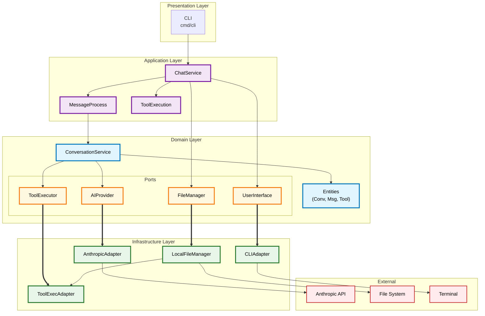

# Code Editing Agent

A sophisticated AI-powered command-line coding assistant built with Go using hexagonal (clean) architecture principles. The agent provides an interactive chat interface for code exploration, editing, and analysis with integrated tool capabilities.

## Overview

Code Editing Agent is an intelligent CLI tool that combines conversational AI with file system operations to assist developers with their coding tasks. Built using Clean Architecture principles, it provides a robust, testable, and extensible foundation for AI-assisted development.

### Key Features

- **Interactive CLI Chat** - Terminal-based conversation with AI assistant
- **Extended Thinking** - Claude's internal reasoning process with configurable token budgets
- **File System Tools** - Read, list, and edit files directly from chat
- **Hexagonal Architecture** - Clean separation of concerns with ports and adapters
- **Tool System** - Modular architecture for adding custom tools with JSON schema validation
- **Session Management** - Multi-session support with unique session IDs
- **Multiple AI Models** - Supports various AI models via Anthropic SDK
- **Dependency Injection** - Clean DI container for managing application dependencies

## Architecture

This project follows hexagonal architecture (also known as ports and adapters), ensuring the domain logic remains independent of external concerns.

### Architecture Diagram



### Layer Responsibilities

| Layer | Responsibility | Located In |
|-------|---------------|------------|
| **Presentation** | CLI commands, user input/output handling | `cmd/cli/` |
| **Application** | Use cases, orchestration, DTOs | `internal/application/` |
| **Domain** | Business entities, services, port interfaces | `internal/domain/` |
| **Infrastructure** | Port implementations, external integrations | `internal/infrastructure/` |

## Project Structure

```
code-editing-agent/
├── cmd/
│   └── cli/
│       ├── main.go              # CLI entry point
│       └── cmd/
│           ├── root.go          # Root command setup
│           └── chat.go          # Chat command implementation
├── internal/
│   ├── application/
│   │   ├── dto/                 # Data transfer objects
│   │   ├── service/             # Application services
│   │   └── usecase/             # Use case implementations
│   ├── domain/
│   │   ├── entity/              # Domain entities (Conversation, Message, Tool)
│   │   ├── port/                # Port interfaces (AI, File, Tool, UI, Skill)
│   │   └── service/             # Domain services
│   └── infrastructure/
│       ├── adapter/             # Port implementations
│       │   ├── ai/              # AI provider adapters
│       │   ├── file/            # File manager adapters
│       │   ├── skill/           # Skill manager adapters
│       │   ├── tool/            # Tool executor adapters
│       │   └── ui/              # User interface adapters
│       └── config/              # Configuration & DI container
├── skills/                      # Project-specific skills (agentskills.io spec)
├── CLAUDE.md                    # Project development guide
├── go.mod                       # Go module definition
└── go.sum                       # Dependency checksums
```

## Getting Started

### Prerequisites

- **Go 1.24 or later** - [Install Go](https://go.dev/doc/install)
- **Anthropic API Key** - Get one from [console.anthropic.com](https://console.anthropic.com/)
- Set the `ANTHROPIC_API_KEY` environment variable

### Installation

1. **Clone the repository**
   ```bash
   git clone <repository-url>
   cd code-editing-agent
   ```

2. **Install dependencies**
   ```bash
   go mod download
   ```

3. **Build the application**
   ```bash
   go build -o agent ./cmd/cli
   ```

4. **Run the application**
   ```bash
   ./agent chat
   ```

### Quick Start

```bash
# Set your API key
export ANTHROPIC_API_KEY=your-api-key-here

# Start the agent
./agent chat

# Or run directly
go run ./cmd/cli main.go chat
```

## Usage

### Basic Chat

```bash
./agent chat
```

Once started, you can interact naturally:

```
Chat with Claude (use 'ctrl+c' to quit)
New session started: 3a1b2c3d4e5f6789...
> List all Go files in the current directory
[Assistant: Reading files...]
[Tool: list_files executed]
[Assistant: Found 5 Go files...]
```

### Extended Thinking Mode

Extended thinking allows Claude to show its internal reasoning process before generating responses. This feature helps you understand how the AI approaches problems and can improve response quality for complex tasks.

#### Enabling Extended Thinking

**Via CLI flags:**
```bash
# Enable with defaults (10,000 token budget, thinking hidden)
./agent chat --thinking

# Enable with custom budget and show thinking
./agent chat --thinking --thinking-budget 15000 --show-thinking
```

**Via environment variables:**
```bash
export AGENT_THINKING_ENABLED=true
export AGENT_THINKING_BUDGET=10000
export AGENT_SHOW_THINKING=true
./agent chat
```

**Via runtime commands:**
```
> :thinking on        # Enable thinking mode
Extended thinking enabled: Budget 10000 tokens

> :thinking off       # Disable thinking mode
Extended thinking disabled

> :thinking toggle    # Toggle current state
```

#### Extended Thinking Options

| Flag | Default | Description |
|------|---------|-------------|
| `--thinking` | `false` | Enable extended thinking mode |
| `--thinking-budget` | `10000` | Token budget for thinking (minimum 1024) |
| `--show-thinking` | `false` | Display AI's reasoning process |
| `--max-tokens` | `20000` | Maximum tokens for responses (increased to accommodate thinking) |

**Notes:**
- Extended thinking requires Claude Sonnet 3.7+ or Claude Sonnet 4.5 models
- The thinking budget is separate from but counted within `max-tokens`
- By default, thinking is processed but not displayed (hidden from output)
- Use `--show-thinking` to see the AI's reasoning in magenta color

### Available Tools

| Tool | Description | Usage |
|------|-------------|-------|
| `read_file` | Read file contents | Ask the AI to "Read file: main.go" |
| `list_files` | List files in directory | Ask to "List all files in ./internal" |
| `edit_file` | Edit files via string replacement | Ask to "Replace this text in file.go" |
| `bash` | Execute shell commands | Ask to "Run command: go test ./..." |

**Built-in Safety Features:**
- **Path Traversal Protection**: All file operations are sandboxed within the working directory
- **Dangerous Command Detection**: Commands like `rm -rf`, `dd`, format operations require confirmation
- **Graceful Shutdown**: Double Ctrl+C to exit, single press shows help message

### Skills

Skills extend the agent's capabilities with specialized knowledge, workflows, or tool integrations. They follow the [agentskills.io](https://agentskills.io) specification.

#### Skill Discovery Locations

Skills are discovered from three directories in **priority order**:

| Priority | Directory | Description |
|----------|-----------|-------------|
| 1 (highest) | `./skills` | Project-specific skills in project root |
| 2 | `./.claude/skills` | Project-specific skills in .claude directory |
| 3 (lowest) | `~/.claude/skills` | User's global skills (shared across projects) |

When the same skill name exists in multiple directories, the **highest priority** version is used. This allows you to override global skills with project-specific versions.

#### Skill Structure

Each skill is a directory containing a `SKILL.md` file with YAML frontmatter:

```
skills/
├── code-review/
│   └── SKILL.md
└── my-custom-skill/
    ├── SKILL.md
    ├── scripts/       # Optional executable scripts
    └── references/    # Optional documentation
```

**Example SKILL.md:**
```yaml
---
name: code-review
description: Reviews code for best practices, errors, and improvements
allowed-tools: read_file list_files
---

# Code Review Skill

Instructions for how the AI should perform code reviews...
```

#### Using Skills

Skills are automatically discovered at startup and listed in the AI's context. The AI can activate a skill when its capabilities are needed using the `activate_skill` tool.

### Configuration

The application supports configuration via:

**Command-line flags:**
```bash
./agent chat --model "hf:zai-org/GLM-4.6" --max-tokens 20000 --thinking
```

**Environment variables (AGENT_* prefix):**
```bash
export AGENT_MODEL=hf:zai-org/GLM-4.6
export AGENT_MAX_TOKENS=20000
export AGENT_WORKING_DIR=/path/to/project
export AGENT_WELCOME_MESSAGE="Hello! How can I help?"
export AGENT_GOODBYE_MESSAGE="Goodbye!"
export AGENT_HISTORY_FILE=""  # Disable history
export AGENT_HISTORY_MAX_ENTRIES=500
export AGENT_THINKING_ENABLED=true
export AGENT_THINKING_BUDGET=10000
export AGENT_SHOW_THINKING=false
```

**Configuration options:**
| Option | Default | Description |
|--------|---------|-------------|
| `--model` | `hf:zai-org/GLM-4.6` | AI model to use |
| `--max-tokens` | `20000` | Maximum tokens in responses |
| `--thinking` | `false` | Enable extended thinking mode |
| `--thinking-budget` | `10000` | Token budget for thinking (min 1024) |
| `--show-thinking` | `false` | Display AI's reasoning process |
| `--workingDir` | `.` | Base directory for file operations |
| `--welcomeMessage` | `Chat with Claude (use 'ctrl+c' to quit)` | Displayed on session start |
| `--goodbyeMessage` | `Bye!` | Displayed on session end |
| `--historyFile` | `~/.agent-history` | Command history file location |
| `--historyMaxEntries` | `1000` | Maximum history entries to keep |

## Development

### Running Tests

```bash
# Run all tests
go test ./...

# Run with coverage
go test -cover ./...

# Run specific package tests
go test ./internal/domain/entity -v
go test ./internal/infrastructure/adapter/file -v
```

### Building

```bash
# Standard build
go build -o code-editing-agent ./cmd/cli

# Optimized build (smaller binary)
go build -ldflags="-s -w" -o code-editing-agent ./cmd/cli
```

### Code Quality

```bash
# Format code
go fmt ./...

# Run static analysis
go vet ./...
```

## Onboarding Guide for Contributors

### Understanding the Codebase

#### 1. Start with the Domain Layer
The domain layer is the heart of the application and contains no external dependencies:

- **Entities** (`internal/domain/entity/`)
  - `Conversation` - Manages chat state and message collection
  - `Message` - Represents individual messages with role, content, and validation
  - `Tool` - Represents executable tools with schema validation

- **Domain Services** (`internal/domain/service/`)
  - `ConversationService` - Core business logic for managing conversations

- **Ports** (`internal/domain/port/`)
  - `AIProvider` - Interface for AI service integration
  - `FileManager` - Interface for file operations
  - `ToolExecutor` - Interface for tool execution
  - `UserInterface` - Interface for CLI interactions

#### 2. Review the Application Layer
This layer orchestrates use cases using domain services:

- **Use Cases** (`internal/application/usecase/`)
  - `MessageProcessUseCase` - Handles message processing flow
  - `ToolExecutionUseCase` - Handles tool execution

- **Services** (`internal/application/service/`)
  - `ChatService` - High-level orchestration service

- **DTOs** (`internal/application/dto/`)
  - Request/response objects for layer boundaries

#### 3. Examine the Infrastructure Layer
Implementations of the ports defined in the domain:

- **Adapters** (`internal/infrastructure/adapter/`)
  - `ai/anthropic_adapter.go` - Anthropic API implementation
  - `file/local_file_adapter.go` - Local file system operations
  - `tool/tool_executor_adapter.go` - Built-in tools (read, list, edit)
  - `ui/cli_adapter.go` - Terminal interface

- **Config** (`internal/infrastructure/config/`)
  - `container.go` - Dependency injection container
  - `config.go` - Configuration management

#### 4. CLI Entry Point
- `cmd/cli/main.go` - Application entry point
- `cmd/cli/cmd/` - CLI command definitions using cobra

### Adding a New Tool

1. **Define the tool in the adapter** (`internal/infrastructure/adapter/tool/tool_executor_adapter.go`)

```go
// In NewExecutorAdapter(), register your tool:
tool := entity.NewTool("search_content", "Search for content in files")
// Set up input schema, then...
exec.RegisterTool(*tool)

// And implement the logic in the ExecuteTool method:
case "search_content":
    return s.searchInFile(input)
```

2. **Tests are required** - Add corresponding tests in `*_test.go`

### Adding a New AI Provider

1. **Implement the AIProvider port** in `internal/infrastructure/adapter/ai/`
2. **Register in the container** - Update `internal/infrastructure/config/container.go`

### Testing Philosophy

The project uses table-driven tests throughout. Look at existing tests for patterns:

- `internal/domain/entity/*_test.go` - Examples of entity testing
- `internal/domain/service/*_test.go` - Service testing with mocks
- `internal/infrastructure/adapter/*/_test.go` - Adapter testing

## Dependencies

| Package | Version | Purpose |
|---------|---------|---------|
| `github.com/anthropics/anthropic-sdk-go` | v1.19.0 | Anthropic API client |
| `github.com/invopop/jsonschema` | v0.13.0 | JSON schema generation |
| `github.com/stretchr/testify` | v1.11.1 | Testing utilities |
| `github.com/spf13/cobra` | v1.10.2 | CLI framework |
| `github.com/spf13/viper` | v1.21.0 | Configuration management |

## License

Specify your license here.

## Contributing

Contributions are welcome! Please ensure:
- All tests pass (`go test ./...`)
- Code is formatted (`go fmt ./...`)
- New features include tests
- Commits follow conventional commit format