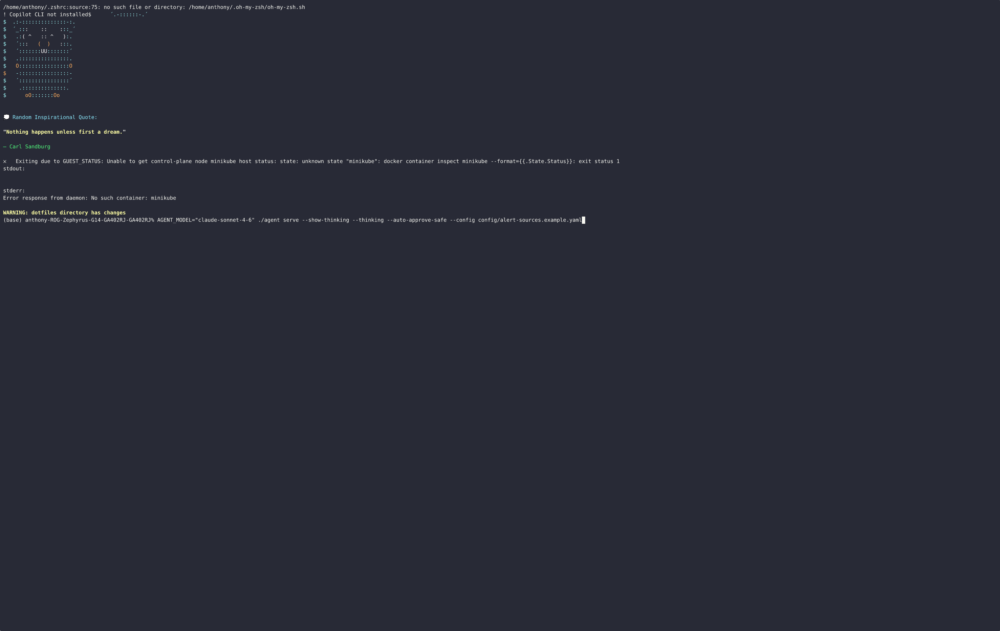
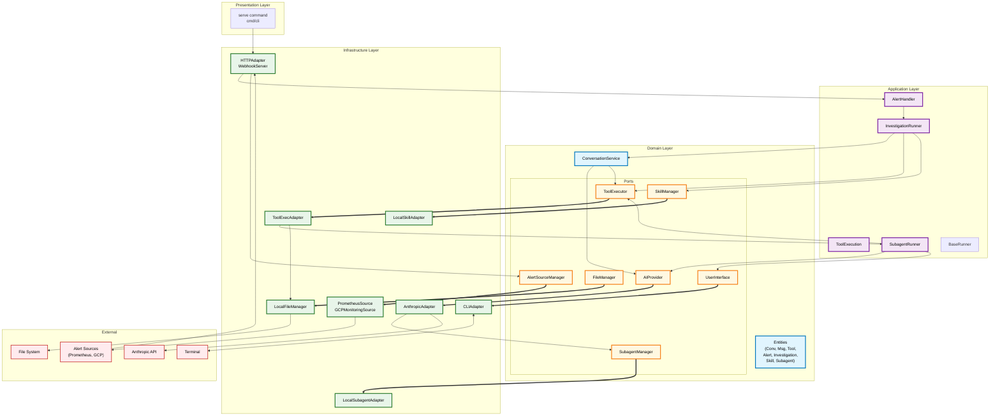

# AI Alert Investigation Agent

[](https://go.dev/)
[](LICENSE)
[](https://github.com/Anthony-Bible/code-agent-demo/actions)

A Go-based AI-powered alert investigation agent built with hexagonal (clean) architecture. The agent receives alerts via webhooks from monitoring systems (Prometheus, GCP Monitoring), automatically investigates them using AI-driven root cause analysis, and provides structured findings with confidence levels and escalation support.



## 🌟 Key Features

- **🚨 Alert & Webhook Server** - HTTP server for receiving alerts from monitoring systems (Prometheus, GCP Monitoring)
- **📊 Automatic Alert Investigation** - AI-driven investigation of alerts with findings, actions, and escalation
- **🔍 Root Cause Analysis** - Structured RCA with confidence scoring and remediation steps
- **🧠 Extended Thinking** - Claude's internal reasoning process with configurable token budgets
- **📁 File System Tools** - Read, list, and edit files during investigations
- **🔄 Subagent System** - Spawn specialized AI assistants for delegated tasks (pre-defined or dynamic, concurrency-safe)
- **📋 Plan Mode** - Propose changes for review before applying them
- **🔄 Auto-Compaction** - Automatic conversation summarization to manage context window limits
- **🏗️ Hexagonal Architecture** - Clean separation of concerns with ports and adapters
- **🔧 Modular Tool System** - Extensible architecture for adding custom tools with JSON schema validation
- **🎯 Skill System** - Project-specific and global AI capabilities following agentskills.io

## 📋 Table of Contents

- [Quick Start](#quick-start)
- [Installation](#installation)
- [Usage](#usage)
  - [Webhook Server Mode](#webhook-server-mode)
  - [Extended Thinking](#extended-thinking-mode-)
  - [Plan Mode](#plan-mode)
  - [Auto-Compaction](#auto-compaction)
  - [Skills](#skills)
  - [Subagents](#subagent-system)
  - [Alerts & Investigations](#alerts--investigations)
- [Configuration](#configuration)
- [Architecture](#architecture)
- [Contributing](CONTRIBUTING.md)
- [License](#license)

## 🚀 Quick Start

```bash
# Set your Anthropic API key
export ANTHROPIC_API_KEY=your-api-key-here

# Build and run the webhook server
go build -o code-agent-demo ./cmd/cli
./code-agent-demo serve --config config/alert-sources.yaml

# Or run directly with Go
go run ./cmd/cli/main.go serve

# The server will start listening on http://localhost:8080 by default
```

## 📦 Installation

### Prerequisites

- **Go 1.24 or later** - [Install Go](https://go.dev/doc/install)
- **Anthropic API Key** - Get one from [console.anthropic.com](https://console.anthropic.com/)

### Installation Methods

#### Method 1: Build from Source (Recommended)

1. **Clone the repository**
   ```bash
   git clone https://github.com/anthony-bible/code-agent-demo.git
   cd code-agent-demo   ```

2. **Install dependencies**
   ```bash
   go mod download
   ```

3. **Build the application**
   ```bash
   go build -o code-agent-demo ./cmd/cli
   ```

#### Method 2: Global Install via Go

```bash
go install github.com/anthony-bible/code-agent-demo/cmd/cli@latest
```

### Verify Installation

```bash
# List available commands
./code-agent-demo --help

# Test serve command
./code-agent-demo serve --help
```

## 🎯 Usage

### Webhook Server Mode

The agent includes a built-in webhook server for receiving alerts from monitoring systems and automatically investigating them.

```bash
# Start the webhook server
./code-agent-demo serve --addr :8080 --config config/alert-sources.yaml

# With auto-approval for safe bash commands
./code-agent-demo serve --addr :8080 --auto-approve-safe
```

#### Supported Alert Sources

The webhook server supports the following alert sources:

| Source Type | Description | Webhook Path Example |
|-------------|-------------|---------------------|
| **Prometheus** | Alerts from Prometheus Alertmanager | `/alerts/prometheus` |
| **GCP Monitoring** | Google Cloud Monitoring Incidents API | `/alerts/gcp` |

#### Alert Sources Configuration

Create a `config/alert-sources.yaml` file:

```yaml
addr: ":8080"

sources:
  # Prometheus Alertmanager webhook source
  - type: prometheus
    name: alertmanager
    webhook_path: /alerts/prometheus

  # Google Cloud Monitoring webhook source
  - type: gcp_monitoring
    name: gcp-alerts
    webhook_path: /alerts/gcp
```

#### Server Endpoints

| Endpoint | Method | Description |
|----------|--------|-------------|
| `/health` | GET | Health check |
| `/ready` | GET | Readiness check |
| `/alerts/{path}` | POST | Webhook receiver for configured sources |

#### Automatic Alert Investigation

When alerts are received:
1. **Critical alerts** automatically trigger an investigation
2. **Warning alerts** wait for manual trigger (configurable)
3. The AI investigates using available tools (logs, metrics, code analysis, custom skills)
4. Investigations produce findings with confidence levels
5. Failed or uncertain investigations can be escalated to humans

For more details on the investigation system, see [Alerts & Investigations](#alerts--investigations).

---

### Extended Thinking Mode 🧠

Extended thinking allows Claude to show its internal reasoning process before generating responses. This feature improves investigation quality for complex alert root cause analysis.

#### Configuration

**Via environment variables:**
```bash
export AGENT_THINKING_ENABLED=true
export AGENT_THINKING_BUDGET=10000
export AGENT_SHOW_THINKING=true
```

| Option | Default | Description |
|--------|---------|-------------|
| `AGENT_THINKING_ENABLED` | `false` | Enable extended thinking mode |
| `AGENT_THINKING_BUDGET` | `10000` | Token budget for thinking (min 1024) |
| `AGENT_SHOW_THINKING` | `false` | Display AI's reasoning process |
| `AGENT_MAX_TOKENS` | `20000` | Maximum tokens for responses |

**Notes:**
- The thinking budget is separate from but counted within max tokens
- Extended thinking is also configurable per-subagent via AGENT.md frontmatter

### Available Tools

| Tool | Description | Usage |
|------|-------------|-------|
| `read_file` | Read file contents | Ask the AI to "Read file: main.go" |
| `list_files` | List files in directory | Ask to "List all files in ./internal" |
| `edit_file` | Edit files via string replacement | Ask to "Replace this text in file.go" |
| `bash` | Execute shell commands | Ask to "Run command: go test ./..." |
| `fetch` | Fetch web resources via HTTP/HTTPS | Ask to "Fetch the contents of https://example.com" |
| `task` | Spawn a pre-defined subagent | Ask to "Delegate security review to code-reviewer" |
| `delegate` | Spawn a dynamic subagent | Ask to "Create an agent to analyze this log file" |
| `batch_tool` | Execute multiple tools in parallel/sequence | Ask to "Read all these 3 files at once" |
| `activate_skill` | Load skill instructions | Ask to "Activate the code-review skill" |
| `enter_plan_mode`| Propose changes before execution | Ask to "Enter plan mode to redesign this" |
| `complete_investigation` | Complete an investigation with findings | Used to finalize investigation with confidence and findings |
| `escalate_investigation` | Escalate investigation to higher priority | Used to escalate issues requiring human review |
| `report_investigation` | Report progress during investigation | Used to provide status updates during investigation |

**Built-in Safety Features:**
- **Path Traversal Protection**: All file operations are sandboxed within the working directory
- **Command Validation Modes**: Blacklist (default) or whitelist approach for bash commands
- **Dangerous Command Detection**: Commands like `rm -rf`, `dd`, format operations require confirmation
- **Graceful Shutdown**: Double Ctrl+C to exit, single press shows help message

#### Command Validation Modes

The agent supports two modes for validating bash commands:

**Blacklist Mode (Default):** Blocks known dangerous commands while allowing everything else. Dangerous patterns include destructive operations (`rm -rf /`), privilege escalation (`sudo`), and network piping (`curl | bash`).

**Whitelist Mode:** Only allows explicitly whitelisted read-only commands. Enable with:
```bash
export AGENT_SAFETY_COMMAND_VALIDATION_MODE=whitelist
```

Default whitelisted commands include:
- File reading: `ls`, `cat`, `head`, `tail`, `less`, `wc`
- Search: `grep`, `rg`, `find`, `fd`, `which`
- Git (read-only): `git status`, `git log`, `git diff`, `git show`
- System info: `pwd`, `whoami`, `ps`, `df`, `du`
- Container (read-only): `docker ps`, `kubectl get`

Write operations (`mkdir`, `rm`, `git push`, `npm install`) are NOT whitelisted by default. Some commands use exclude patterns to block dangerous flags while allowing safe usage.

**Adding Custom Whitelist Patterns:**

Use the `AGENT_SAFETY_COMMAND_WHITELIST_JSON` environment variable with a JSON array of pattern objects:

```bash
# Allow a single custom command
export AGENT_SAFETY_COMMAND_WHITELIST_JSON='[
  {"pattern": "^my-safe-tool(\\s|$)", "description": "my safe tool"}
]'

# Allow multiple custom commands
export AGENT_SAFETY_COMMAND_WHITELIST_JSON='[
  {"pattern": "^my-tool(\\s|$)", "description": "my tool"},
  {"pattern": "^another-tool\\s", "description": "another tool"},
  {"pattern": "^make\\s+test", "description": "make test target"}
]'

# Allow go build and go run (not in default whitelist)
export AGENT_SAFETY_COMMAND_WHITELIST_JSON='[
  {"pattern": "^go\\s+build(\\s|$)", "description": "go build"},
  {"pattern": "^go\\s+run\\s", "description": "go run"}
]'

# Allow npm install for a specific project
export AGENT_SAFETY_COMMAND_WHITELIST_JSON='[
  {"pattern": "^npm\\s+install(\\s|$)", "description": "npm install"}
]'
```

Each entry in the JSON array supports:
- `pattern` (required): Regex pattern to match commands
- `exclude_pattern` (optional): Regex pattern to block even if the main pattern matches
- `description` (optional): Human-readable description of the pattern

**Exclude Patterns:**

Use `exclude_pattern` to allow a command while blocking dangerous flags:

```bash
# Allow find but block -exec, -delete, and similar dangerous flags
export AGENT_SAFETY_COMMAND_WHITELIST_JSON='[
  {
    "pattern": "^find(\\s|$)",
    "exclude_pattern": "(?i)(-exec\\s|-execdir\\s|-delete(\\s|$)|-ok\\s|-okdir\\s)",
    "description": "find files (read-only)"
  }
]'
```

This allows `find . -name "*.go"` but blocks `find . -exec rm {} \;`. The `(?i)` prefix makes the exclusion case-insensitive.

**Pattern syntax tips:**
- `^command` - Match at start of line
- `(\s|$)` - Match whitespace or end of string (for commands with or without args)
- `\s+` - Match one or more whitespace characters
- Patterns are Go regular expressions

**Piped Commands:** In whitelist mode, piped commands (e.g., `ls | grep foo`) are validated by checking each segment independently. All segments must be whitelisted for the command to execute.

**LLM Fallback:** When `AGENT_SAFETY_ASK_LLM_ON_UNKNOWN=true` (default), non-whitelisted commands prompt for user confirmation instead of being immediately blocked. Set to `false` for strict whitelist-only mode.

**Investigation Mode:** Command validation applies consistently across all execution contexts (webhook investigations, subagent tasks). The same whitelist/blacklist configuration governs all modes, so security policies are enforced regardless of how the agent is running.

**Security Note:** Environment variables (`$VAR`, `${VAR}`) are NOT expanded during validation. The whitelist checks literal command text, but shell expands variables at runtime. Be cautious with commands that may output sensitive environment data. Note that command substitutions (`$()` and backticks) ARE recursively validated.

See CLAUDE.md for the complete list of default whitelisted commands and additional configuration options.

### Skills

Skills extend the agent's capabilities with specialized knowledge, workflows, or tool integrations. They follow the [agentskills.io](https://agentskills.io) specification.

**Important Note on Tool Restrictions:** If any active skill defines `allowed-tools`, the entire session is restricted to only those explicitly allowed tools. Unrestricted skills activated alongside restricted ones will be silently limited by those restrictions.

#### Skill Discovery Locations

Skills are discovered from three directories in **priority order**:

| Priority | Directory | Description |
|----------|-----------|-------------|
| 1 (highest) | `./skills` | Project-specific skills in project root |
| 2 | `./.claude/skills` | Project-specific skills in .claude directory |
| 3 (lowest) | `~/.claude/skills` | User's global skills (shared across projects) |

When the same skill name exists in multiple directories, the **highest priority** version is used. This allows you to override global skills with project-specific versions.

#### Skill Structure

Each skill is a directory containing a `SKILL.md` file with YAML frontmatter:

```
skills/
├── code-review/
│   └── SKILL.md
└── my-custom-skill/
    ├── SKILL.md
    ├── scripts/       # Optional executable scripts
    └── references/    # Optional documentation
```

**Example SKILL.md:**
```yaml
---
name: code-review
description: Reviews code for best practices, errors, and improvements
allowed-tools: read_file list_files
---

# Code Review Skill

Instructions for how the AI should perform code reviews...
```

#### Using Skills

Skills are automatically discovered at startup and listed in the AI's context. The AI can activate a skill when its capabilities are needed using the `activate_skill` tool.

#### Community Skills

- [google-cloud-metrics-skill](https://github.com/Anthony-Bible/google-cloud-metrics-skill) - Query Google Cloud Monitoring metrics during investigations

#### Skill Hot-Reload

Send `SIGHUP` to the server to reload skills without restarting:
```bash
kill -HUP <pid>
```

### Subagent System

The subagent system allows the main agent to delegate tasks to specialized or dynamic AI assistants. This is useful for complex, multi-step tasks, focused problem-solving, or when isolation is beneficial.

#### Context Window Isolation

**Important:** Each subagent runs in its own **isolated conversation context** with a fresh context window. This means:

- ✅ **Clean slate**: Subagents start with only their system prompt (from AGENT.md) and the delegated task
- ✅ **No history leakage**: The parent conversation's message history is NOT passed to subagents
- ✅ **Efficient resource usage**: Subagents don't consume tokens from the parent's context window
- ✅ **Focused execution**: Each subagent concentrates solely on its assigned task

The subagent receives only:
1. Its custom system prompt from the `AGENT.md` file
2. The task description/prompt from the parent agent
3. Results from tools it executes during its session

When the subagent completes, its output is returned to the parent as a condensed summary, not the full conversation history.

#### Pre-defined Subagents

Subagents are discovered from three directories in **priority order**:
1. `./code-agent-demo` (project root, highest priority)
2. `./.claude/agents` (project .claude directory)
3. `~/.claude/agents` (user global, lowest priority)

When the same agent name exists in multiple directories, the highest priority version is used. Common agents include `code-reviewer`, `test-writer`, and `documentation-writer`. Each agent has its own `AGENT.md` file defining its system prompt, allowed tools, model selection, and thinking configuration.

**Agent Configuration Options:**
- **allowed_tools**: Restrict which tools the agent can use for safety
- **model**: Choose between `haiku` (fast), `sonnet` (balanced), `opus` (complex), or `inherit` (default)
- **max_actions**: Limit tool calls to prevent runaway execution (default: 20)
- **thinking_enabled**: Enable/disable extended thinking for this agent (default: inherit)
- **thinking_budget**: Token budget for thinking process (default: inherit)

See CLAUDE.md for detailed AGENT.md format and frontmatter options.

**Usage:**
```
> Delegate a security review of internal/infrastructure to the code-reviewer agent
```

#### Dynamic Subagents (Delegation)

You can also create dynamic agents on-the-fly with custom system prompts using the `delegate` tool. These dynamic subagents also benefit from isolated context windows.

**Usage:**
```
> Use the delegate tool to create a 'regex-specialist' to help fix these patterns
```

#### Recursion Prevention

To prevent infinite loops, subagents cannot spawn other subagents. The `task` tool is blocked when executing in a subagent context. This ensures task delegation remains one level deep and predictable.

### Plan Mode

Plan mode allows proposed changes to be reviewed before they are applied. When in plan mode, tools like `edit_file` or `bash` (if mutating) will write their intended actions to a plan file (`.agent/plans/`) instead of executing them. The AI can enter plan mode using the `enter_plan_mode` tool when it detects a complex or risky task.

### Auto-Compaction

Auto-compaction automatically summarizes long conversations to prevent hitting context window limits. When the total token usage (input + output) exceeds a configurable threshold, the conversation history is replaced with an AI-generated summary that preserves key decisions, code changes, file paths, and important context.

#### How It Works

1. After each AI response, the service checks total token usage against the threshold
2. If the threshold is exceeded **and** no tool calls are in progress, compaction triggers
3. The AI generates a detailed summary of the entire conversation
4. The conversation history is replaced with a single summary message prefixed with `[CONVERSATION SUMMARY - Auto-compacted]`
5. The token counter resets based on the summary size

Compaction is **deferred during tool execution cycles** to avoid summarizing mid-operation. If compaction fails, the conversation continues normally (non-fatal).

#### Configuration

| Option | Default | Description |
|--------|---------|-------------|
| `AGENT_COMPACTION_THRESHOLD` | `160000` | Token threshold that triggers auto-compaction |

The minimum allowed threshold is `10,000` tokens. Values below this floor are automatically raised to prevent excessive compaction.

```bash
# Use default (160,000 tokens)
./code-agent-demo serve

# Set a custom threshold
export AGENT_COMPACTION_THRESHOLD=100000
./code-agent-demo serve
```

#### What the Summary Preserves

- Key decisions and reasoning
- Code changes and file paths
- Error messages and resolutions
- Tool calls and their results (truncated for brevity)
- System prompts (stored separately, always preserved)

---

### Alerts & Investigations

The alert and investigation system enables automatic incident response and root cause analysis.

#### Investigation Lifecycle

An investigation progresses through these states:

```
started → running → completed
                ├───→ failed
                └───→ escalated
```

| State | Description |
|-------|-------------|
| **started** | Initial state when investigation is created |
| **running** | Investigation is actively gathering information |
| **completed** | Investigation finished successfully with findings |
| **failed** | Investigation encountered an unrecoverable error |
| **escalated** | Investigation requires human intervention |

#### Investigation Features

- **Findings**: Captures discoveries, potential root causes, and observations
- **Actions**: Tracks all tool executions with inputs, outputs, and duration
- **Confidence**: Float value from 0.0 (no confidence) to 1.0 (full confidence)
- **Escalation**: Automatic escalation when investigation cannot determine root cause

#### Severity Levels

| Level | Description | Auto-Investigate |
|-------|-------------|------------------|
| **critical** | Urgent issue requiring immediate attention | Yes |
| **warning** | Potential issue that should be investigated | No (configurable) |
| **info** | Informational notification | No |

#### Alert Sources

The agent supports multiple alert sources via webhooks:

##### Prometheus Alertmanager

Configured to receive alerts from Prometheus Alertmanager. Include resource labels, metric labels, and alert annotations.

##### GCP Monitoring

Receives incidents from Google Cloud Monitoring v1.2 webhook API. Maps GCP severity levels (CRITICAL, ERROR, WARNING, INFO) to the agent's severity system.

#### Configuration Example

```yaml
# config/alert-sources.yaml
addr: ":8080"

sources:
  - type: prometheus
    name: alertmanager
    webhook_path: /alerts/prometheus

  - type: gcp_monitoring
    name: gcp-alerts
    webhook_path: /alerts/gcp
```

#### Investigation Tools

During an investigation, the AI can use tools to:
- Read log files (`bash`, `read_file`)
- Query metrics (via custom skills — see [Community Skills](#community-skills))
- Analyze code traces
- Check system state
- Execute diagnostic commands

#### Escalation

When an investigation cannot determine a root cause with high confidence, it can be escalated:

```
Investigation escalated to human review:
- Confidence: 0.45
- Findings: 3 observations, no definitive root cause
- Recommended actions: Manual log inspection required
```

### Configuration

The application supports configuration via environment variables (`AGENT_*` prefix) and command-line flags.

**Environment variables:**
```bash
export AGENT_MODEL=hf:zai-org/GLM-4.7
export AGENT_MAX_TOKENS=20000
export AGENT_WORKING_DIR=/path/to/project
export AGENT_THINKING_ENABLED=true
export AGENT_THINKING_BUDGET=10000
export AGENT_SHOW_THINKING=false

# Command validation (security)
export AGENT_SAFETY_COMMAND_VALIDATION_MODE=whitelist  # or "blacklist" (default)
export AGENT_SAFETY_COMMAND_WHITELIST_JSON='[{"pattern": "^custom-cmd\\s", "description": "custom command"}]'
export AGENT_SAFETY_ASK_LLM_ON_UNKNOWN=true            # Ask before blocking non-whitelisted
export AGENT_SAFETY_AUTO_APPROVE_SAFE=false             # Auto-approve non-dangerous bash commands
```

**Configuration options:**

| Option | Default | Description |
|--------|---------|-------------|
| `AGENT_MODEL` | `hf:zai-org/GLM-4.7` | AI model to use |
| `AGENT_MAX_TOKENS` | `20000` | Maximum tokens in responses |
| `AGENT_THINKING_ENABLED` | `false` | Enable extended thinking mode |
| `AGENT_THINKING_BUDGET` | `10000` | Token budget for thinking (min 1024) |
| `AGENT_SHOW_THINKING` | `false` | Display AI's reasoning process |
| `AGENT_WORKING_DIR` | `.` | Base directory for file operations |
| `--auto-approve-safe` | `false` | Auto-approve non-dangerous bash commands |
| `AGENT_COMPACTION_THRESHOLD` | `160000` | Token threshold for auto-compaction (min 10,000) |

### Serve Command Configuration

```bash
# Webhook server configuration
./code-agent-demo serve --addr :8080 --config config/alert-sources.yaml

# Available flags:
--addr                 Address to listen on (default: :8080)
--config               Path to alert sources config file (default: config/alert-sources.yaml)
--auto-approve-safe    Auto-approve non-dangerous bash commands (default: false)
```

**Security configuration (environment variables only):**

| Variable | Default | Description |
|----------|---------|-------------|
| `AGENT_SAFETY_COMMAND_VALIDATION_MODE` | `blacklist` | `blacklist` or `whitelist` |
| `AGENT_SAFETY_COMMAND_WHITELIST_JSON` | (none) | JSON array of additional regex patterns |
| `AGENT_SAFETY_COMMAND_WHITELIST_OVERRIDE` | `false` | Replace default whitelist patterns with custom ones |
| `AGENT_SAFETY_ASK_LLM_ON_UNKNOWN` | `true` | Ask LLM before blocking non-whitelisted commands |
| `AGENT_SAFETY_AUTO_APPROVE_SAFE` | `false` | Auto-approve non-dangerous bash commands |

## Architecture

This project follows hexagonal architecture (also known as ports and adapters), ensuring the domain logic remains independent of external concerns. See [CONTRIBUTING.md](CONTRIBUTING.md) for detailed layer responsibilities, domain entities, and project structure.


```mermaid
flowchart TB
    subgraph CLI["Presentation Layer"]
        SERVE_CMD["serve command<br/>cmd/cli"]
    end

    subgraph APP["Application Layer"]
        UC2["ToolExecution"]
        UC3["AlertHandler"]
        UC4["InvestigationRunner"]
        UC5["SubagentRunner"]
        UC6["BaseRunner"]
    end

    subgraph DOMAIN["Domain Layer"]
        ENT["Entities<br/>(Conv, Msg, Tool,<br/>Alert, Investigation,<br/>Skill, Subagent)"]
        SRV["ConversationService"]

        subgraph PORTS["Ports"]
            P1["AIProvider"]
            P2["ToolExecutor"]
            P3["FileManager"]
            P4["UserInterface"]
            P5["SkillManager"]
            P6["SubagentManager"]
            P7["AlertSourceManager"]
        end
    end

    subgraph INFRA["Infrastructure Layer"]
        A1["AnthropicAdapter"]
        A2["ToolExecAdapter"]
        A3["LocalFileManager"]
        A4["CLIAdapter"]
        A5["LocalSkillAdapter"]
        A6["LocalSubagentAdapter"]
        A7["PrometheusSource<br/>GCPMonitoringSource"]
        A8["HTTPAdapter<br/>WebhookServer"]
    end

    subgraph EXT["External"]
        E1["Anthropic API"]
        E2["File System"]
        E3["Terminal"]
        E4["Alert Sources<br/>(Prometheus, GCP)"]
    end

    %% Serve/webhook path
    SERVE_CMD --> A8
    A8 --> UC3
    UC3 --> UC4
    UC4 --> SRV

    %% SubagentRunner is reached via ToolExecAdapter -> SubagentUseCase
    A2 --> UC5

    %% Port usage
    SRV --> P1
    SRV --> P2
    UC4 --> P2
    UC4 --> P5
    UC5 --> P1
    UC5 --> P2
    UC5 --> P4
    A8 --> P7

    %% Port implementations
    P1 ==> A1
    P2 ==> A2
    P3 ==> A3
    P4 ==> A4
    P5 ==> A5
    P6 ==> A6
    P7 ==> A7

    %% AnthropicAdapter uses SubagentManager for agent context
    A1 --> P6

    %% External connections
    A1 --> E1
    A3 --> E2
    A2 --> A3
    A4 <--> E3
    A7 --> E4
    E4 --> A8

    classDef domain fill:#e1f5fe,stroke:#0277bd,stroke-width:3px,color:#000
    classDef app fill:#f3e5f5,stroke:#7b1fa2,stroke-width:3px,color:#000
    classDef infra fill:#e8f5e9,stroke:#2e7d32,stroke-width:3px,color:#000
    classDef port fill:#fff8e1,stroke:#f57f17,stroke-width:3px,color:#000
    classDef ext fill:#ffebee,stroke:#c62828,stroke-width:2px,color:#000

    class ENT,SRV domain
    class SVC,UC1,UC2,UC3,UC4,UC5 app
    class A1,A2,A3,A4,A5,A6,A7,A8 infra
    class P1,P2,P3,P4,P5,P6,P7 port
    class E1,E2,E3,E4 ext
```

## Contributing

See [CONTRIBUTING.md](CONTRIBUTING.md) for development setup, testing, onboarding guide, and how to add new tools, alert sources, and AI providers.

## License

Specify your license here.